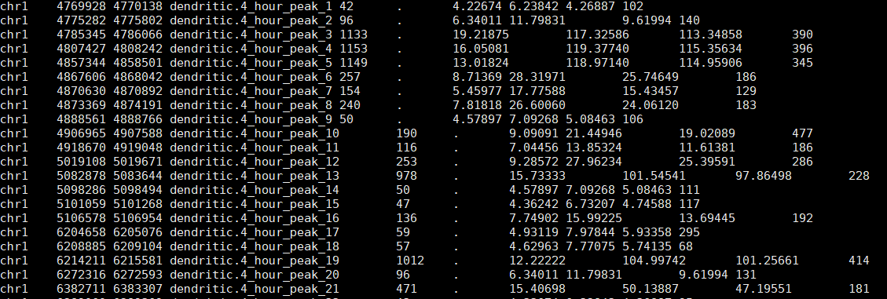
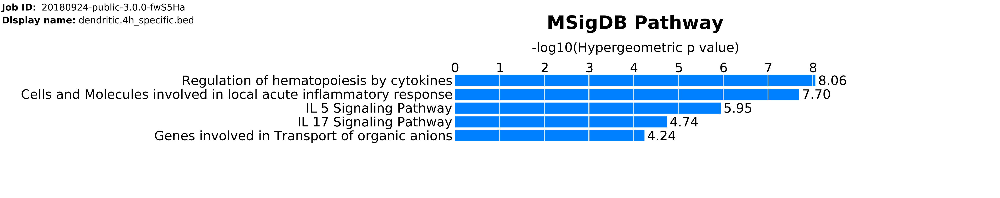
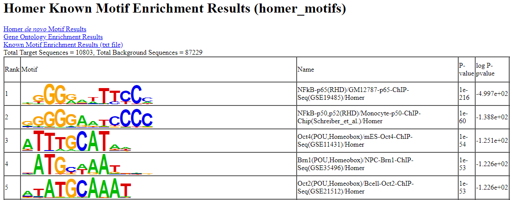
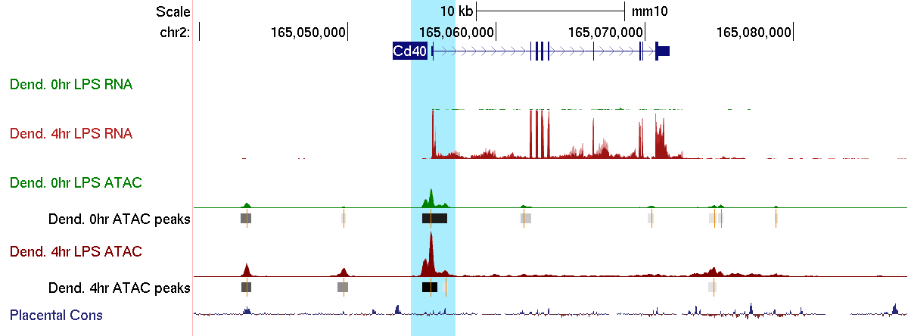

# BIOM 200 bioinformatics bootcamp - ATAC-seq analysis

* [(Pre-class) Introduction](#introduction)
* [(Pre-class) Installations](#installations)
* [(In-class) Data processing](#processing)
* [(In-class) Data analysis](#processing)
* [(In class) Genome browser](#genomebrowser)
* [(Optional) Single cell ATAC-seq](#scatac)

## <a name="introduction"></a>Introduction

ATAC-seq is an assay that captures accessible chromatin first described in [Buenrostro et al. 2013](https://doi.org/10.1038/nmeth.2688), and it stands for Assay for Transposase-Accessible Chromatin using sequencing. It has become a popular assay because of its advantages over previous assays (DNAseI-seq and FAIRE-seq), such as the relatively easy protocol and low cellular input.

In this tutorial, we will cover:
* Processing ATAC-seq data
* High level summary using gene ontology
* Finding enriched transcription factor motifs
* Visualizing results on the UCSC genome browser
___


___
Unlike something like ChIP-seq, ATAC-seq is typically not run with a control due to the limited information obtained. ATAC-seq is typically sequenced with paired-end sequencing for the following reasons:

* More sequence data leads to better alignment results. Many genomes contain numerous repetitive elements, and failing to align reads to certain genomic regions unambiguously renders those regions inaccessible to the assay. 

* With ATAC-seq, we are interested in knowing the full span of the DNA fragments generated by the assay. A DNA fragment generated by the ATAC is typically longer than a sequence read, so a read will define only one end of the fragment. Therefore, with single-end sequencing, we would have to guess where the other end of the fragment is. Since paired-end sequencing generates reads from both ends, the full span of the DNA fragment is known precisely.

* PCR duplicates are identified more accurately. PCR duplicates are artifacts of the ATAC-seq procedure, and they should be removed as part of the analysis pipeline. However, computational programs that remove PCR duplicates (e.g. Picard's MarkDuplicates) typically identify duplicates based on comparing ends of aligned reads. 


## <a name="installations"></a>Installations

### Command-line imports

TSCC has a few programs installed already, so all we have to do is load them. To check all available modules, you can type `module avail` on the command line. Add the following lines to your `.bashrc` file. These will automatically load the program [bwa](http://bio-bwa.sourceforge.net/bwa.shtml) and [bedtools](https://bedtools.readthedocs.io/en/latest/) each time you open a new terminal shell. We also need to tell bash to search in the following places for `trim_galore` and `homer`, which we will be using later.

```
PATH=$PATH:/oasis/tscc/scratch/biom200/bms_2018/programs
PATH=$PATH:/oasis/tscc/scratch/biom200/bms_2018/homer/bin
module load bwa
module load bedtools
```

Now open a new terminal window. Typing in `bwa` should bring up the user manual.

### Python installations

We will need to install a couple programs and modules.

```
conda install -c bioconda cutadapt macs2
```

### Index the reference genome for BWA

We will need an indexed reference genome for the BWA algorithm. Each aligner program has expects its own index, so we can't simply reuse the one we built for STAR in the RNA-seq alignment section. In the interest of time, I have already downloaded and prepared a reference genome for you. We will just need to link it over from the common directory.

```
ln -s /oasis/tscc/scratch/biom200/bms_2018/bwa_ref/ ~/scratch/bwa_ref
```
If you want to prepare the reference genome yourself, download the GRCm38 (mm10) genome sequence from gencode and use `bwa index` to prepare it. 

```
wget ftp://ftp.ebi.ac.uk/pub/databases/gencode/Gencode_mouse/release_M18/GRCm38.p6.genome.fa.gz
gunzip GRCm38.p6.genome.fa.gz
mv GRCm38.p6.genome.fa mm10.fa
bwa index mm10.fa
```

## <a name="processing"></a>Data processing

### Obtaining the datasets

These ATAC-seq datasets are from the ENCODE project website and were generated from the same samples that were used for the RNA-seq portion of this bootcamp.

You can find them here:  
https://www.encodeproject.org/experiments/ENCSR347RZI/  
https://www.encodeproject.org/experiments/ENCSR984HFU/

To simplify things, we will start with processing the 4 hour timepoint.

Create a new directory for ATAC-seq and create links to the `.fastq` files that were pre-downloaded.
```
mkdir -p ~/raw_data/ATAC/ ~/projects/ATAC/
ln -s /oasis/tscc/scratch/biom200/bms_2018/atac_seq/raw_data/*.fastq.gz ~/raw_data/ATAC/
cd ~/projects/ATAC/
```


### Trimming adapter sequences from reads

Adapter trimming is necessary because of the way ATAC-seq works (tagmentation, where the DNA is simulaneously fragmented and sequencing adapters are added). Adapters in the sequencing data may prevent the reads from aligning to the reference genome and adversely affect the downstream analysis.

For ATAC-seq data, we trim adapter sequence using a program called [trim_galore](https://github.com/FelixKrueger/TrimGalore/blob/master/Docs/Trim_Galore_User_Guide.md). The nice thing about this program is that it automatically detects which adapters are present in your reads (Nextera adapters for ATAC-seq). 

We need to specify that our reads are paired-end (`--paired`). This could take a while, but it's not memory intensive. Submit this as a script (`qsub -V`).

```
#!/bin/bash
#PBS -q hotel
#PBS -N trim_adapters
#PBS -l nodes=1:ppn=4
#PBS -l walltime=1:00:00
#PBS -o trim_adapters.out
#PBS -e trim_adapters.err

trim_galore --paired --output_dir ~/projects/ATAC/ ~/raw_data/ATAC/dendritic.4_hour.R1.fastq.gz ~/raw_data/ATAC/dendritic.4_hour.R2.fastq.gz
```

The program will take a while to run, but in the end it should output two new files in the `~/projects/ATAC/` directory with trimmed reads:   
`dendritic.4_hour.R1_val_1.fq.gz` and `dendritic.4_hour.R2_val_2.fq.gz`.
___

### Align reads to the reference genome

We can now align the reads to a reference genome (mm10) and look for peaks of transposition activity. We will use the [bwa mem](http://bio-bwa.sourceforge.net/bwa.shtml) aligner and pipe the output to [samtools](http://www.htslib.org/doc/samtools.html) for an initial filter on high quality mapped reads with `samtools view`. We will next use `samtools fixmate`, which is necessary for the duplicate removal step later. We will finally sort by coordinate with `samtools sort` and use `samtools markdup` to mark and remove duplicate sequences. In this long chain of commands, we use `-` to indicate we want to read the output from the previous command.

We will need a copy of the mm10 reference genome prepared earlier (see installations for instructions for preparing a different reference genome, e.g. hg19 for human data).

*WARNING*: This command may take a long time to run, so submit it as a script. Use `qsub -V` to ensure that your paths get copied over to the job.

```
#!/bin/bash
#PBS -q hotel
#PBS -N bwa_mapping
#PBS -l nodes=1:ppn=16
#PBS -l walltime=1:00:00
#PBS -o bwa_mapping.out
#PBS -e bwa_mapping.err

module load bwa

bwa mem -t 16 ~/scratch/bwa_ref/mm10.fa ~/raw_data/ATAC/dendritic.4_hour.R1_val_1.fq.gz ~/raw_data/ATAC/dendritic.4_hour.R2_val_2.fq.gz \
| samtools view -@ 8 -b -u -h -f 3 -F 256 -F 2048 -q 30 - \
| samtools fixmate -m - -  \
| samtools sort -m 4G -@ 8 - \
| samtools markdup -r - ~/projects/ATAC/dendritic.4_hour.nodup.bam
```

We used a couple of argument flags for `samtools view`. Here are what some of them mean:
* `-b`: output BAM or binary format
* `-u`: output uncompressed which is useful for piping to other samtools commands
* `-h`: output header
* `-f 3`: only include alignments marked with the SAM flag `3`, which means "properly paired and mapped"
* `-F 256`: exclude alignments with flag `256`, which means that bwa mapped the read to multiple places in the reference genome, and this alignment is not the best
* `-F 2048`: exclude alignments marked with SAM flag `2048`, indicating chimeric alignments, where bwa decided that parts of the read mapped to different regions in the genome. These records are the individual aligned segments of the read. They usually indicate structural variation. We're not going to base peak calls on them.
* `-q 30`: exclude alignments with a mapping score < 30

The manual page for samtools has more information on flags and how to use them to filter your alignments.  
It's hard to remember what the flags mean. Lucky for us, there's a web-based tool by the Broad Institute to [explain SAM flags](https://broadinstitute.github.io/picard/explain-flags.html).
___

### Call accessible chromatin peaks

Let's assume that we have aligned and processed both datasets (0 hour, 4 hour). We have the final `.bam` files from both of these datasets, so the next step is to call peaks on all of them.

We will next use [MACS2](https://github.com/taoliu/MACS) to call peaks (regions with high transposition activity) on the aligned reads. Use `qsub -V` to ensure that your paths get copied over to the job.

```
#!/bin/bash
#PBS -q hotel
#PBS -N peaks
#PBS -l nodes=1:ppn=1
#PBS -l walltime=1:00:00
#PBS -o peaks.out
#PBS -e peaks.err

macs2 callpeak -t ~/projects/ATAC/dendritic.4_hour.nodup.bam -n dendritic.4_hour --outdir ~/projects/ATAC/ -g mm --nomodel --shift -100 --extsize 200
```

MACS2 calls peaks using the default false discovery rate (FDR) of 0.05. If you don't know what an false discovery rate is, don't worry, you'll learn more about it in the statistics class in Winter/Spring quarter. Basically, instead of setting a hard p-value cutoff of 0.05 every time regardless of the p-value distribution, an FDR considers the shape of the p-value distribution and adjusts accordingly.

We used a couple of argument flags for `macs2 callpeak`. Here are some of them mean:
* `-t`: the "treatment" file -- the input, which is the BAM file from the previous step
* `-n`: the name of the experiment, which is used to name files
* `-g`: the genome's mappable size; 'mm' is an alias for the mouse genome's mappable size
* `--nomodel, --shift, and --extsize`: MACS2 was originally designed for ChIP-seq data, so we're telling it not to use its built-in model, but to extend and shift reads in a way appropriate for ATAC-seq.

When the program finishes running, there should be an output file called `dendritic.0_hour_peaks.narrowPeak`.
These are our final ATAC-seq peaks in [BED format](https://genome.ucsc.edu/FAQ/FAQformat.html), which is a file format that contains genomic coordinates. 

Open the peaks file for viewing 

```
less -S ~/projects/ATAC/dendritic.4_hour_peaks.narrowPeak
```

This should be a tab-separated BED file - each row in this file contains information about a single ATAC-seq peak. The first three columns will contain information about where the peak is located within the genome, specifically these are chromosome, start position, and end position.

>Here is an example of what you should see.  


**Now run the same command on the other dataset.**
___

If you've reached this point, try processing the other dataset.  

*HINT*: You can put everything together (trimming adapters, aligning, calling peaks) in a script and submit it as a job. Make sure you change the filenames!

## <a name="analysis"></a>Data analysis


### bedtools

[BEDtools](https://bedtools.readthedocs.io/en/latest/) (bedtools) is a command-line program that was designed around manipulating BED files. Try typing in `bedtools` on the command line and you will see that it has a wide range of functions.

We will use bedtools to see how many peak calls overlap and differ between our two timepoints.

Let's check the concordance between the peak calls.
We can first check how many lines are in each BED file with a simple `wc -l` (line count) command. **How many peaks were called for each timepoint?** Modify this command to count the lines for both BED files.

```
wc -l ~/projects/ATAC/dendritic.4_hour_peaks.narrowPeak
```

Next, we will use the `bedtools intersect` command to figure out how many peaks are common to both datasets.
You can find the documentation for it [here](https://bedtools.readthedocs.io/en/latest/content/tools/intersect.html).

**How would you use this command to find out the number of common peaks between the two timepoints?**  
*HINT*: pipe your outputs to `wc -l` 

Now that we know how many peaks are similar between the two timepoints, let's find out the number of peaks that differ between them.  

**How would you use the bedtools intersect command to do this?**  
*HINT*: you want the inverse of intersect
___

### GREAT (gene ontology for non-coding regions)
[GREAT](http://great.stanford.edu/public/html/) stands for Genomic Regions Enrichment of Annotations Tool, which is basically a fancy way to say gene ontology without using genes as input. Instead, the input is used-defined genomic regions, which could be from any range of genomic assays (e.g. ATAC-seq, ChIP-seq, WGBS). GREAT assigns genomic regions to genes using a combination of methods. Based on these gene assignments, it then runs standard gene ontology which can provide a high-level summary of the data.

Here, we will use GREAT to analyze the broad changes between the 4 hour and 0 hour timepoints. Specifically, we will see what gene ontology terms are enriched in the peaks specific to the 4 hour timepoint as compared to all 4 hour timepoint peaks.

First, we will want to format our `narrowPeak` files into test and background regions for input into GREAT.  
GREAT expects a BED file as input with 4 columns: chromosome, start, end, and peak name. 

Use the `bedtools intersect` command that we used earlier to find peaks specific to the 4 hour timepoint.  
Our `narrowPeak` file contains some extraneous information that we don't need for GREAT, so we will use the `cut` utility to extract the columns we need (`-f 1-4` means columns 1-4).

```
bedtools intersect -a ~/projects/ATAC/dendritic.4_hour_peaks.narrowPeak \
-b ~/projects/ATAC/dendritic.0_hour_peaks.narrowPeak -v | cut -f 1-4 \
> ~/projects/ATAC/dendritic.4h_specific.bed

cut -f 1-4 ~/projects/ATAC/dendritic.4_hour_peaks.narrowPeak > ~/projects/ATAC/dendritic.4h_background.bed
```

Next, transfer the GREAT input files to a location on your local computer.  
You can use `scp` (or drag + drop on the sidebar for MobaXterm users).

Navigate to the [GREAT web tool](http://great.stanford.edu/public/html/).

We will use these options:  
**Species Assembly**: `Mouse: NCBI build 38 (UCSC mm10, Dec/2011)`  
**Test regions**: `dendritic.4h_specific.bed`  
**Background regions**: `dendritic.4h_background.bed`  

It will take a few minutes, but the results should return in the same web browser.

Scroll down to MSigDB Pathway results. Do the results make sense?

> You can visualize the results as a bar graph. It should look something like this.  

___

### Motif enrichment
One of the powerful uses of ATAC-seq is to find the transcriptional drivers that mediate changes in expression. Through a sequence motif enrichment analysis, we can use the DNA sequences underlying the accessible chromatin regions to discover which transcription factors (TFs) are likely driving these changes. 


We will use the program [HOMER](http://homer.ucsd.edu/homer/motif/), which was developed by [Chris Benner](https://profiles.ucsd.edu/christopher.benner) at UCSD. HOMER works by identifying sequences of various lengths that are enriched in the test set relative to the background. For the test set, we will use the 4h specific peaks, and we will use all 4h peaks as the background. HOMER can automatically create a GC-content matched background, but it's better to specify a background in this case because we want to know what TF motifs are enriched after treatment.

We will be using the `findMotifsGenome.pl` script from the HOMER program. You can find the documentation for this tool [here](http://homer.ucsd.edu/homer/ngs/peakMotifs.html).

```
#!/bin/bash
#PBS -q hotel
#PBS -N motifs
#PBS -l nodes=1:ppn=4
#PBS -l walltime=1:00:00
#PBS -o motifs.out
#PBS -e motifs.err

findMotifsGenome.pl ~/projects/ATAC/dendritic.4h_specific.bed mm10 homer_motifs -bg ~/projects/ATAC/dendritic.4h_background.bed -size 200 -nomotif -bits -mset vertebrates -p 4
```

The first three positional arguments to `findMotifsGenome.pl` are:
1. input BED file
2. HOMER reference genome
3. output directory

We used a couple of argument flags for `findMotifsGenome.pl`. Here are what some of them mean:
* `-bg`: specifies that we want to use a background regions file instead of having automatically match random regions
* `-size`: fragment size to use for motif finding
* `-nomotif`: skips the *de novo* motif scanning part of the HOMER routine (for speed)
* `-bits`: output the motif sequence logos scaled for information content
* `-mset`: use the vertebrates motif collection for known motif enrichment

This may take a while - HOMER will output a progress log.

When HOMER finishes running, there will be an output directory (`homer_motifs` which we specified earlier) containing all of the motif enrichment results. The file that contains the summary of the analysis is `knownResults.html`, which stores results for the top enriched motifs. Transfer this file to your local computer with `scp` (or drag + drop on the sidebar for MobaXterm users) and open it with your default web browser.

> You should see something that looks like this (this screenshot shows a truncated view of the top 5 results). 


By far, the most enriched motif is NFKB, which makes sense given that LPS treatment should signal through Toll-like receptors and activate the NFKB pathway. However, among the top results we see examples of repeated known motif matches. This happens because the DNA binding motifs of TFs in the same family may be extremely similar, such as the OCT (POU) family (core sequence motif: ATGCAAAT).


## <a name="genomebrowser"></a>Genome browser

I've compiled a UCSC genome browser session with some of the data we've been working with this bootcamp.  
It often helps to visualize the data you're working with, instead of looking at numbers all the time.

https://genome.ucsc.edu/cgi-bin/hgTracks?hgS_doOtherUser=submit&hgS_otherUserName=jchiou42&hgS_otherUserSessionName=BMS_bootcamp_2018

In this session, I have included the two replicates of RNA-seq data that Ryan used for differential expression, as well as the ATAC-seq data that I used.

You can use this session to visualize peaks in one dataset, but not the other.  
For example, look up the region surrounding the Cd40 gene `chr2:165039617-165087673`, which has highly upregulated expression when dendritic cells are treated with LPS.



Although there are dramatic differences in expression, the chromatin profile only changes slightly (at the promoter and generally across the gene body).

## <a name="scatac"></a>Single cell ATAC-seq

Single cell methods enable researchers to capture finer resolution than ever before, and allow pinpointing disease mechanisms and regulatory programs to specific cell types within a bulk tissue sample. The analysis of single cell ATAC-seq is many times more challenging than analyzing single cell RNA-seq, because accessible chromatin is essentially binary at the single-cell level.  
___
For those interested in learning more about single cell ATAC-seq or those who have finished everything early, there is a well-documented tutorial for [analyzing a mouse atlas dataset](http://atlas.gs.washington.edu/mouse-atac/).  


___
Papers that demonstrate use cases of single cell ATAC-seq include:

1. [Mouse Atlas](https://doi.org/10.1016/j.cell.2018.06.052)  
2. [Fly Embryo](https://www.nature.com/articles/nature25981)  
3. [Mouse Forebrain](https://www.nature.com/articles/s41593-018-0079-3)  
4. [Hematopoietic Landscape](https://doi.org/10.1016/j.cell.2018.03.074)  
